# UX flow-k

Ez a dokumentum a 2026-04-08-ig frissített kódállapot UX szintű összefoglalása. A `docs/assets/ux/` mappában a jelenlegi mobilflow-khoz tartozó screenshot evidence elérhető, beleértve az account/profile, pricing, refund és review állapotokat is.

## 1. Felhasználói regisztráció, bejelentkezés és password reset

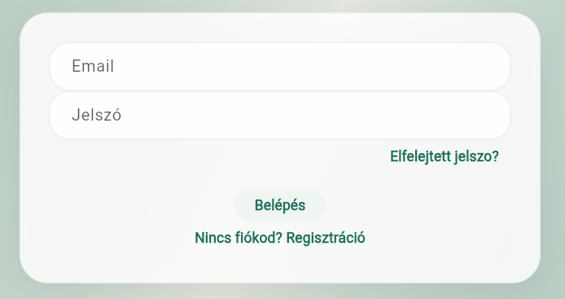
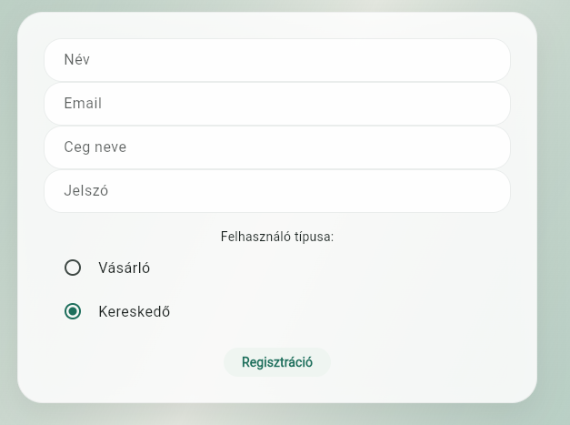

### Cél

A felhasználó tudjon új fiókot létrehozni, password resetet kezdeményezni, majd szerepkörének megfelelően belépni az alkalmazásba.

### Lépéssor

1. A felhasználó megnyitja a `NearPick - Bejelentkezés` képernyőt.
2. Ha még nincs fiókja, megnyitja a regisztrációs képernyőt.
3. Megadja az email címet, jelszót és a szükséges profiladatokat. Kereskedőként cégnevet is meg kell adnia.
4. Sikeres regisztráció vagy bejelentkezés után a rendszer a szerepkör alapján a fogyasztói vagy kereskedői kezdőképernyőre navigál.
5. Ha elfelejtette a jelszavát, dialógusban reset emailt kérhet.

### Happy path

- A mezők helyesen vannak kitöltve.
- A Firebase Auth elfogadja a hitelesítést.
- A `users` gyűjteményből a szerepkör kiolvasható.
- A felhasználó a megfelelő kezdőképernyőre jut.
- Password resetnél sikeres email-küldési visszajelzés jelenik meg.

### Hibaállapotok

- Hibás email vagy jelszó.
- Hiányzó vagy érvénytelen regisztrációs adat.
- Kereskedői regisztrációnál hiányzó cégnév.
- API kulcs vagy localhost auth domain probléma webes futtatásnál.
- Hálózati hiba vagy ideiglenesen nem elérhető Firebase szolgáltatás.

### Üres állapotok

- Új felhasználónak még nincs meglévő profiladata vagy preferenciája.
- A regisztrációs képernyő első megnyitásakor minden mező üres.

### Screenshot evidence

- A bejelentkezési képernyő alapállapota: `login.png`
- A regisztrációs képernyő szerepkör-választással: `register.png`

### Akadálymentességi megfontolások

- A beviteli mezők címkével rendelkeznek.
- A hibák szövegesen, nem csak színnel jelennek meg.
- A fő műveletek gombbal indíthatók, ezért érintőképernyőn és billentyűzettel is követhetők.

## 2. Fogyasztói böngészés, helybeállítás és foglalás

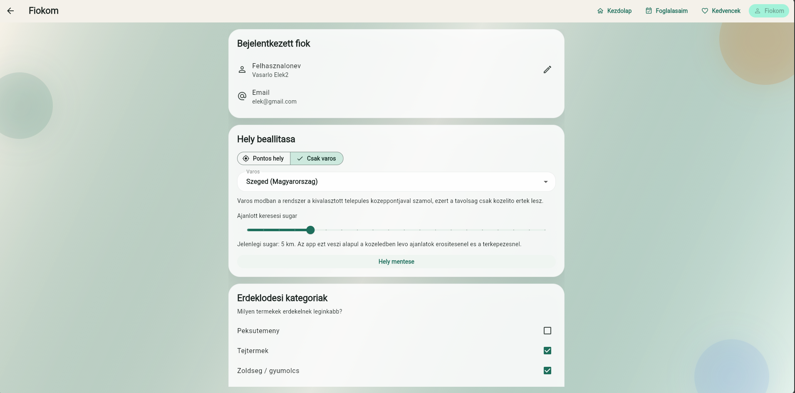
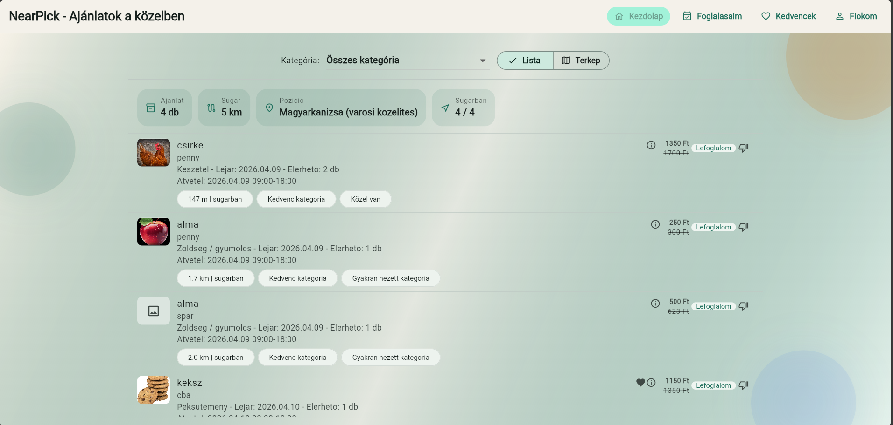
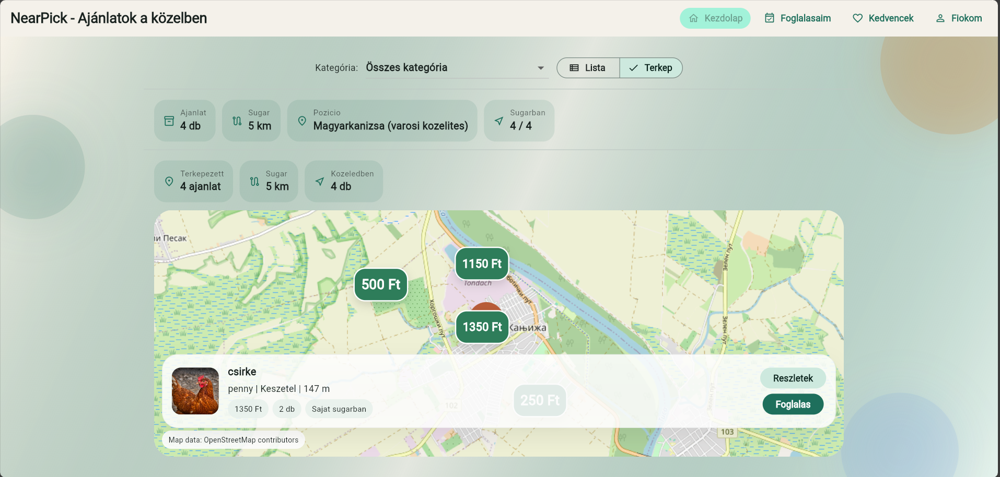
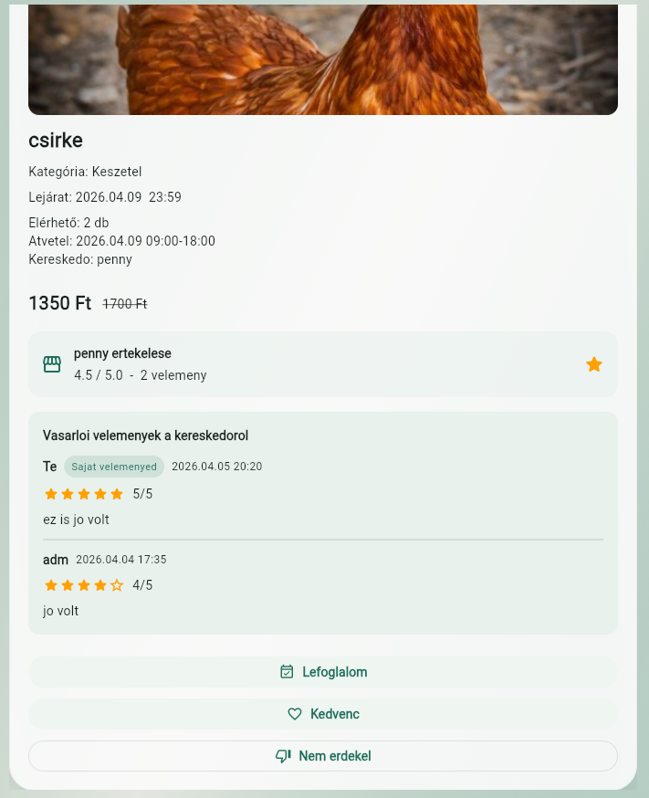
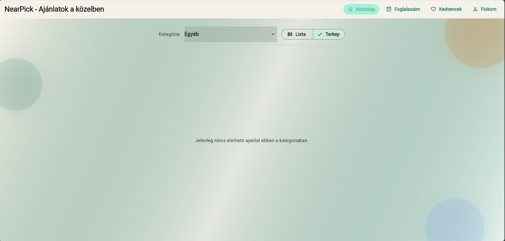
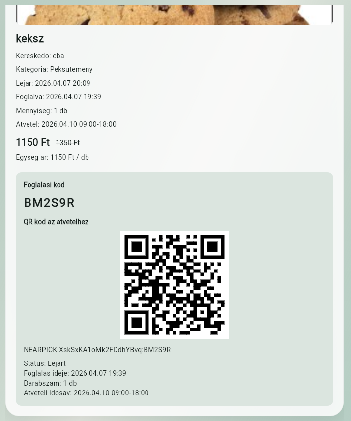

### Cél

A fogyasztó gyorsan találjon releváns ajánlatokat, tudja szűrni a listát, account oldalon beállítani a helyet vagy várost, megnyitni a részleteket, majd egy vagy több darabot lefoglalni.

### Lépéssor

1. A felhasználó belép fogyasztói szerepkörrel.
2. Megnyílik az ajánlatlista.
3. A felhasználó kategóriát választ a szűrőből, és szükség esetén az account oldalon beállítja a pontos vagy város alapú helyet.
4. Megnyit egy terméket vagy a listából / térképről kezdeményez foglalást.
5. Ha az ajánlatnál több darab érhető el, mennyiségválasztó dialógus jelenik meg.
6. A rendszer a foglalási részletre vagy a termék részleteire navigál.

### Happy path

- A terméklista betöltődik.
- A kategóriaszűrő működik.
- A helyalapú rangsorolás és a releváns termékek sorrendje az ajánlási logika alapján frissül.
- A foglalás gomb aktív, ha van elérhető készlet.
- A foglalás részletoldalon látszik a pickup code, QR token, mennyiség és refund állapot.

### Hibaállapotok

- A terméklista betöltése hibával megszakad.
- A foglalás sold-out, insufficient-quantity vagy backend hiba miatt meghiúsul.
- A termékkép nem tölthető be, ezért csak placeholder vagy thumbnail fallback jelenik meg.
- A helybeállítás érvénytelen vagy a helyhozzáférés tiltott.

### Üres állapotok

- Nincs elérhető ajánlat a kiválasztott kategóriában vagy sugáron belül.
- A felhasználónak még nincs kedvenc kategóriája vagy implicit preferenciája.
- A foglalási lista üres, mert még nincs aktív vagy korábbi reservation.

### Screenshot evidence

- Az account és helybeállítás képernyő: `consumer_account.png`
- A lista normál betöltött állapota: `consumer_feed.png`
- Alternatív feed / listanézet állapot: `consumer_feed2.png`
- Üres kategóriaállapot felhasználói szöveges visszajelzéssel: `consumer_empty_state.png`
- A termék részletoldal foglalási CTA-val: `product_detail.png`
- A sikeres foglalás utáni részletképernyő pickup kóddal és státusszal: `reservation_detail.png`

### Akadálymentességi megfontolások

- A listaelemek szöveges információt is tartalmaznak, nem csak képet.
- A fontos műveletek (`Lefoglalom`, `Miért ajánlott?`, `Nem érdekel`) jól elkülönülnek.
- Az üres és hibás állapotok rövid, olvasható szöveges visszajelzést adnak.

## 3. Kereskedői profil, termékfeltöltés és szerkesztés

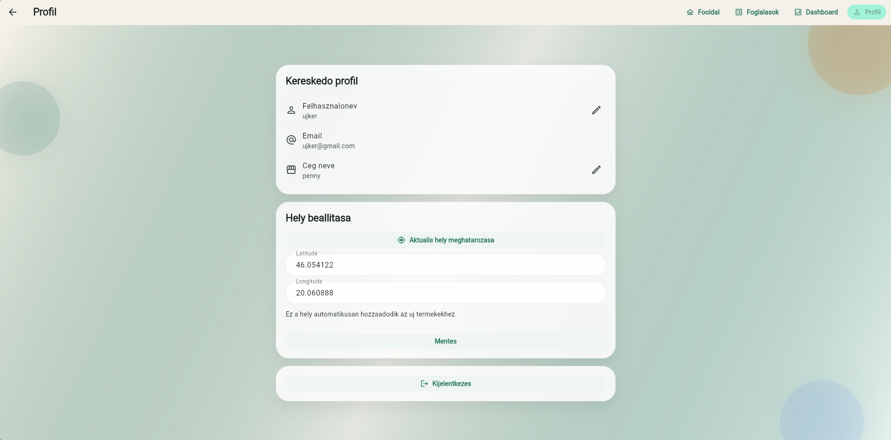
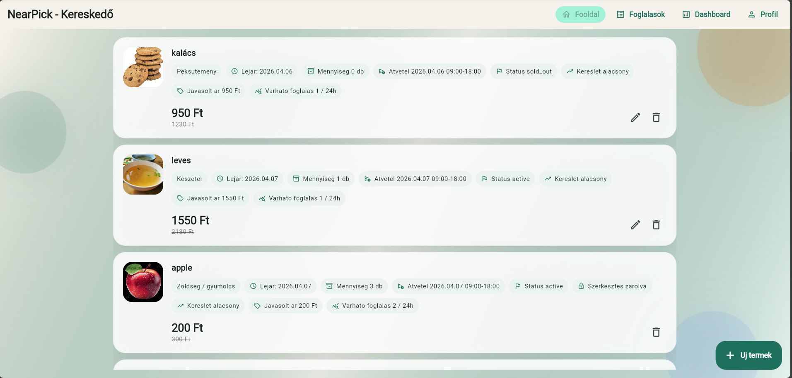
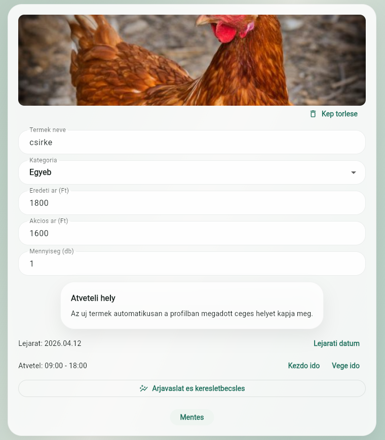
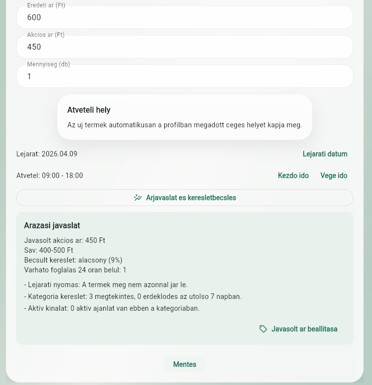
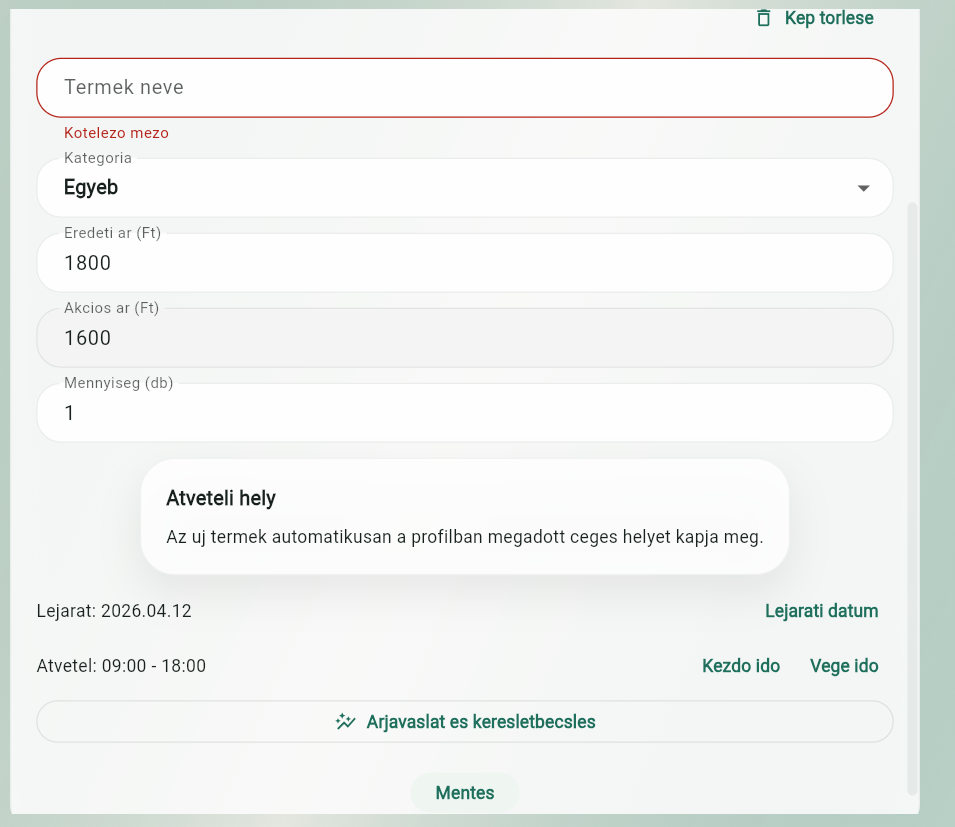

### Cél

A kereskedő gyorsan tudjon céghelyet beállítani, új terméket közzétenni vagy a még nem foglalt terméket szerkeszteni, miközben a rendszer a helyadatot újra tudja használni.

### Lépéssor

1. A felhasználó kereskedői fiókkal belép.
2. A profil oldalon megadja vagy frissíti a cégnevet és céghelyet.
3. A kezdőképernyőn megnyomja a `+` gombot vagy megnyit egy már létező terméket szerkesztésre.
4. Kitölti a termék nevét, kategóriáját, árait, mennyiségét, lejáratát és átvételi idősávját.
5. Opcionálisan képet választ vagy készít, illetve árjavaslatot kér.
6. Mentés után a rendszer visszanavigál a kereskedői listára.

### Happy path

- Minden kötelező mező valid.
- A céghely be van állítva vagy a termék már rendelkezik helyadattal.
- Az árjavaslat lekérhető és manuálisan alkalmazható.
- A termék mentése lefut.
- Az új vagy szerkesztett termék megjelenik a kereskedő saját listájában.

### Hibaállapotok

- Hiányzó kötelező mező vagy hibás számszerű adat.
- A lejárati dátum nincs kiválasztva, vagy az átvételi idősáv vége nem későbbi, mint a kezdete.
- A céghely nincs beállítva, ezért az új termék nem menthető.
- Az árjavaslat lekérése vagy a feltöltés backend vagy hálózati hiba miatt megszakad.
- A már lefoglalt termék szerkesztése tiltott.

### Üres állapotok

- Az első belépő kereskedő listája üres, ezért a rendszer szövegesen jelzi, hogy még nincs feltöltött termék.
- A képfeltöltés opcionális, ezért üres képterületből is indulhat a folyamat.
- A céghely még nincs beállítva, ezért a profil oldalon kell elkezdeni a folyamatot.

### Screenshot evidence

- A kereskedői profil cégnévvel és céghellyel: `merchant_profile.png`
- A kereskedői lista aktív termékekkel: `merchant_home.png`
- A kitöltött termékfeltöltő űrlap: `new_product_form.png`
- Az árjavaslat megjelenítése a feltöltési flow-ban: `price_recommendation.png`
- Validációs hiba kötelező mező hiányánál: `new_product_validation_error.png`

### Akadálymentességi megfontolások

- Az űrlapmezők mind címkézettek.
- A validációs hibák szövegként megjelennek.
- A helymeghatározás, pricing és mentés külön, jól azonosítható gombbal indítható.
- A képfeltöltés nem kizárólagos bemeneti mód, a termék kép nélkül is menthető.

## 4. Reservation lifecycle, QR átvétel, refund és review

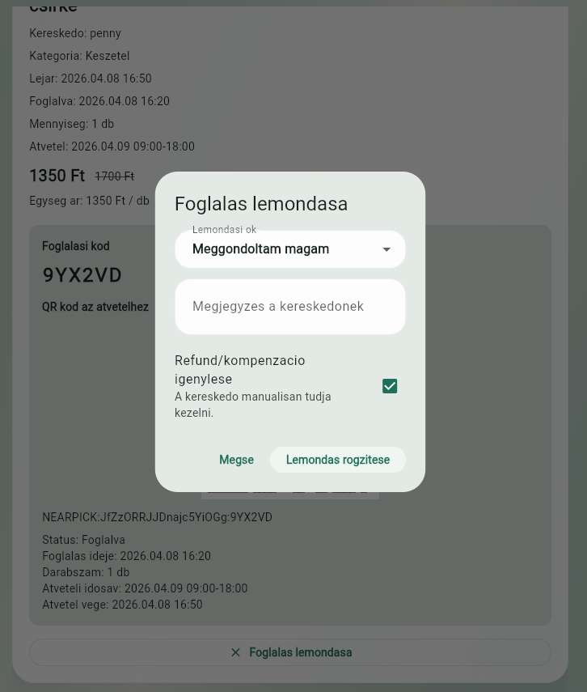
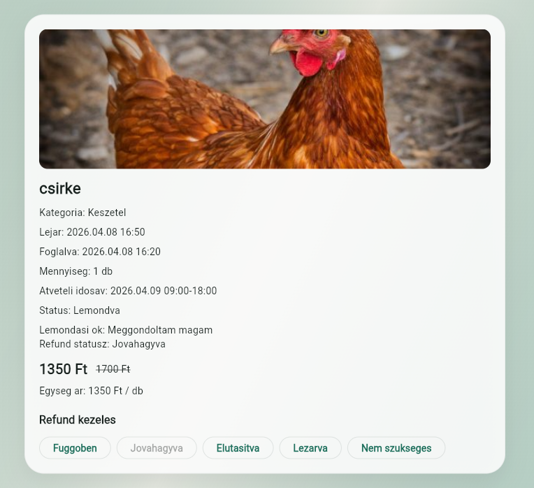
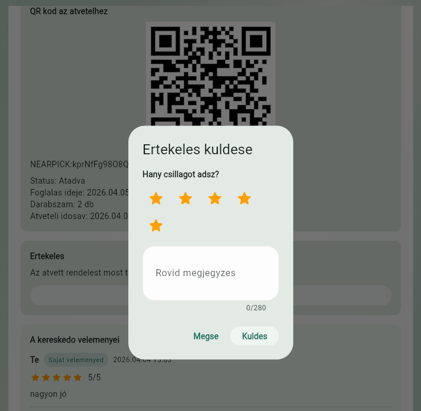

### Cél

A foglalási életciklus teljes útja átlátható legyen a vásárló és a kereskedő oldalán is, beleértve a QR vagy pickup code alapú átvételt, a lemondást, a refund követést és a completed foglalás utáni review küldést.

### Lépéssor

1. A fogyasztó megnyitja a foglalás részleteit.
2. A rendszer megjeleníti a mennyiséget, a pickup code-ot, a QR tokent és az aktuális állapotot.
3. A kereskedő a foglaláslistában vagy a detail oldalon QR scannerrel vagy kézi pickup inputtal ellenőrzi az átvételt.
4. Lemondás esetén a fogyasztó okot és opcionális megjegyzést ad meg, majd refund igényt kapcsolhat.
5. A kereskedő a refund státuszt kezeli.
6. Completed foglalás után a fogyasztó review-t küldhet, ami megjelenik a merchant oldalon.

### Happy path

- A QR/pickup input érvényes, ezért a reservation `completed` állapotba kerül.
- Lemondásnál a termék készlete visszaáll, és a refund státusz `pending` lehet.
- Completed foglalás után egy review küldhető be, amely azonnal látható a merchant review listában.

### Hibaállapotok

- Érvénytelen pickup input.
- Lejárt vagy már nem megfelelő állapotú foglalás.
- Érvénytelen refund státusz vagy jogosulatlan refund kezelés.
- Több review beküldése ugyanarra a foglalásra.

### Üres állapotok

- Nincs korábbi foglalása a fogyasztónak.
- Nincs még review a kereskedőnél.
- Nincs refundot igénylő reservation.

### Evidence

- A foglalás részlet képernyő pickup kóddal és QR tokennel: `reservation_detail.png`
- A lemondási flow és refund kérés: `cancel_reservation.png`
- A merchant refund állapotkezelő képernyő: `manage_refund.png`
- A completed reservation utáni review flow: `review_flow.png`
