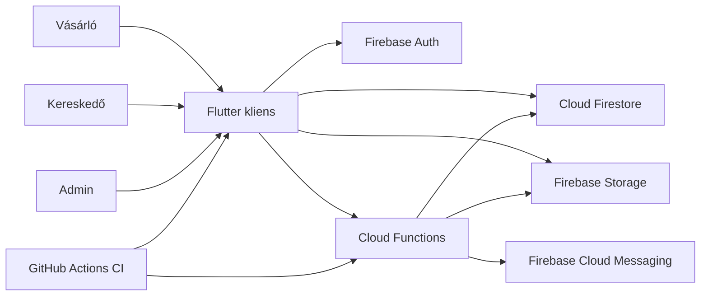

# Architektúra áttekintés

## Rendszer célja

A NearPick célja, hogy a közeli, időérzékeny kedvezményes termékeket gyorsan összekapcsolja a fogyasztókkal, miközben a kereskedők egyszerűen tudnak új ajánlatokat közzétenni és a foglalásokat kezelni. A rendszer elsődleges fókusza a gyors reagálású piactér-élmény, nem pedig egy nehéz, sokrétegű vállalati backend.

## Fő komponensek

- Flutter kliensalkalmazás
  - auth, consumer, merchant és admin képernyők
  - account/profile, location, favorites, review és dashboard UI-k
  - admin dashboard, user/product/reservation áttekintés és moderációs UI-k
  - ajánlási logika és kliensoldali szűrés
  - Firebase SDK integrációk
- Firebase Auth
  - email/jelszó azonosítás és session alapú hozzáférés
- Cloud Firestore
  - felhasználók, termékek, érdeklődések, foglalások, review-k és preferenciaadatok
- Firebase Storage
  - termékképek tárolása
- Cloud Functions
  - foglalási, refund, review, archiválási, repricing és admin callable műveletek
  - eseményvezérelt értesítési és thumbnail-generáló logika
- Firebase Cloud Messaging
  - push értesítések
- GitHub Actions CI
  - lint, build és teszt futtatás

## Kliens-vezérelt architektúra indoklása

A jelenlegi rendszer kliens-vezérelt, mert az MVP és a szakdolgozati célok szempontjából ez adta a legjobb egyensúlyt a fejlesztési sebesség, a bemutathatóság és az alacsony üzemeltetési teher között. A Flutter kliens közvetlenül dolgozik a Firebase SDK-kkal, ezért a UI, a navigáció és több domain workflow gyorsan implementálható és jól dokumentálható. A választás tudatos tradeoff: a kliens vastagabb, miközben a biztonsági határokat a backend-oldali rule-oknak kell kikényszeríteniük.

## Serverless backend rationale

A Firebase serverless backend választás indoka az volt, hogy a hitelesítés, adattárolás, fájlkezelés és értesítés egyetlen integrált platformon belül legyen elérhető. Ez különösen előnyös olyan piactér esetén, ahol:

- a termékadatok valós időben frissülnek
- a push értesítések fontos felhasználói értéket adnak
- kis csapat vagy egyéni fejlesztés mellett is fenntartható üzemeltetési modell szükséges
- a szakdolgozati leadásban egyszerre kell működő prototípust és reprodukálható dokumentációt adni

## Adatáramlási narratíva

1. A felhasználó bejelentkezik a Flutter kliensen keresztül Firebase Auth segítségével.
2. A kliens a `users/{uid}` dokumentumból kiolvassa a szerepkört és a preferenciákat.
3. A fogyasztói nézet a Firestore aktív termékadataiból feedet épít, majd kliensoldalon szűri és pontozza az ajánlatokat a location és preferencia adatok alapján.
4. A kereskedő profiloldalon cégnevet és céghelyet állít be; ezt az új termék flow alapértelmezetten felhasználja.
5. A kereskedő új terméket hoz létre vagy szerkeszt, amely a Firestore-ban és opcionálisan a Storage-ban jelenik meg, a fő képhez pedig thumbnail generálódik.
6. Új termék létrehozásakor Cloud Function indulhat, amely szegmentált értesítéseket küld a releváns fogyasztóknak.
7. Foglaláskor a backend callable tranzakció csökkenti a készletet, létrehozza a foglalási rekordot, pickup code-ot és pickup tokent generál.
8. A kereskedő QR vagy pickup input alapján teljesíti a foglalást, a refund státuszt kezeli, a completed foglalás után pedig review érkezhet.
9. Admin claimmel rendelkező aktív felhasználó admin dashboardon áttekinti a rendszerállapotot, fiókstátuszt módosít, terméket moderál, foglalási részletet néz meg, vagy admin üzenetet küld kereskedőnek.

## Authorization modell röviden

Az authorization modell három pillérre épül:

- Firebase Auth alapú hitelesítés
- Firebase Auth custom claim alapú admin jogosultság (`admin: true`)
- Firestore és Storage security rules alapú backend jogosultságkikényszerítés
- Cloud Functions oldali üzleti szabály-ellenőrzés a kritikus reservation, product és admin műveletekhez
- ownership és role mezők használata (`ownerId`, `merchantId`, `buyerId`, `role`)

A kliensoldali tiltások és gombállapotok UX célúak, de nem helyettesítik a backend kontrollt. A biztonsági modell lényege, hogy a felhasználó csak a saját adataihoz és a szerepkörének megfelelő erőforrásokhoz férjen hozzá.

## Deployment high-level modell

- Lokális fejlesztés és demó
  - Flutter kliens + külön demo Firebase projekt
  - opcionálisan teljes Firebase Emulator Suite vagy Functions emulátor helyi logolási célra
- CI
  - GitHub Actions futtatja a format, analyze, build és test lépéseket
- Backend kiadási modell
  - Firebase alapú deployment szemlélet
  - szabályok, functions és kapcsolódó konfigurációk verziókezelten élnek a repositoryban
  - a CI evidence és a reviewer demó külön release artefaktumokban követett

## Kapcsolódó dokumentumok

- `adr/00_index.md`
- `c4_context_container.md`
- `c4_component.md`
- `quality_attributes.md`
- `../03_design/api.md`
- `../03_design/data_model.md`
