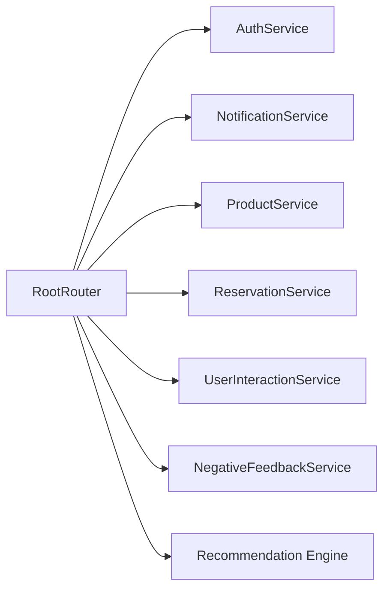
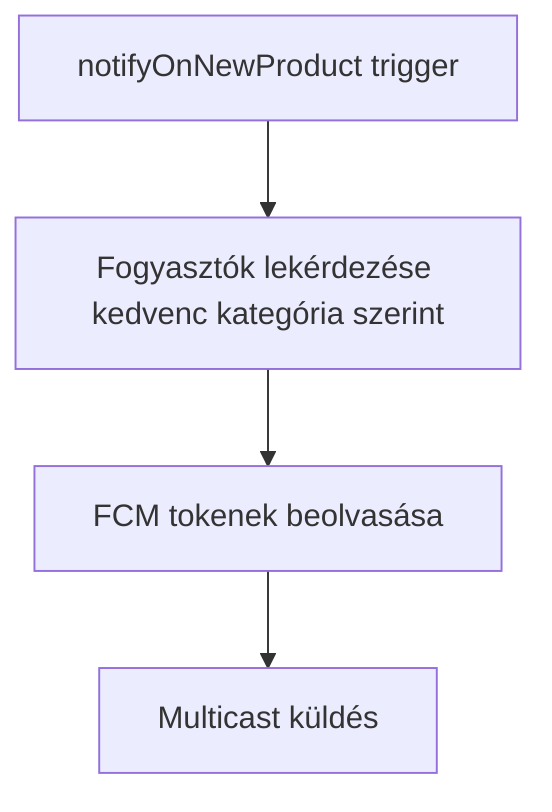

# C4 komponensnézet

## Mobilalkalmazás komponensei

### Felelősségek

- `RootRouter`: auth state kezelés és szerepalapú navigáció.
- `AuthService`: regisztráció/bejelentkezés/kijelentkezés és user profile bootstrap.
- `ProductService`: termék létrehozási/archiválási/érdeklődési műveletek.
- `ReservationService`: foglalási és foglalásteljesítési tranzakciós folyamat.
- `NotificationService`: token regisztráció és tokenfrissítés perzisztálása.
- `UserInteractionService`: implicit preferencia- és interakciónaplózás.
- `NegativeFeedbackService`: elutasításalapú negatív preferenciakezelés.
- `Recommendation Engine`: pontszámítás és ajánlási indokok.

## Backend komponensnézet

### Felelősségek

- A függvénytrigger reagál a `products/{productId}` létrehozási eseményeire.
- Lekérdezi a fogyasztói usereket kategóriapreferencia alapján.
- Beolvassa a token alkollekciót és kötegelt FCM multicast értesítéseket küld.

## Ismert határok és hiányok

- A tranzakcióintenzív foglalási és számlálási logika jelenleg kliensvezérelt, és meg van jelölve lehetséges function-oldali megerősítésre.
- Egyes validációs logikák UI-hoz kötöttek, és tervben van a kiszervezésük tesztelhető tiszta helper függvényekbe.
