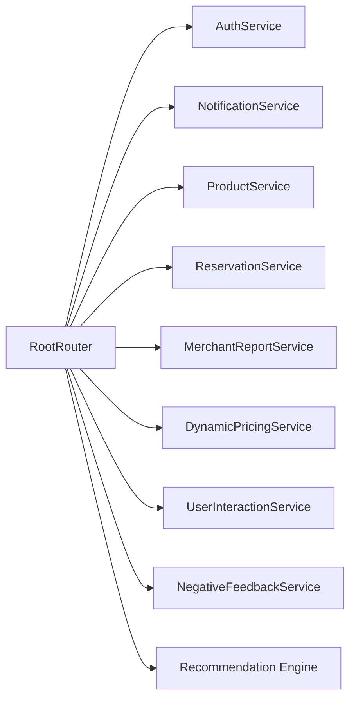
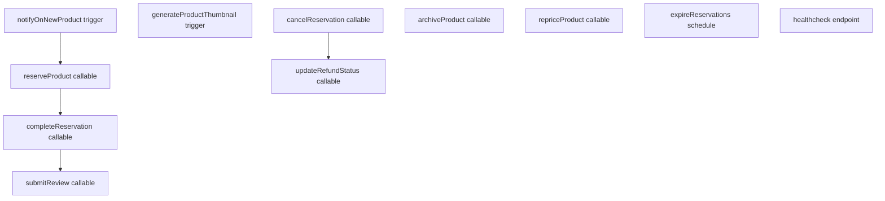

# C4 komponensnézet

## Mobilalkalmazás komponensei

### Felelősségek

- `RootRouter`: auth state kezelés, role routing és notification bootstrap.
- `AuthService`: regisztráció/bejelentkezés/kijelentkezés, password reset és user profile bootstrap / update.
- `ProductService`: termék létrehozási, szerkesztési, archiválási, repricing és érdeklődési műveletek.
- `ReservationService`: foglalási, foglalásteljesítési, lemondási, refund és review folyamat.
- `NotificationService`: token regisztráció és tokenfrissítés perzisztálása.
- `MerchantReportService`: merchant dashboard CSV export előállítása és letöltés / clipboard fallback.
- `DynamicPricingService`: pricing recommendation lekérés és a merchant flow támogatása.
- `UserInteractionService`: implicit preferencia- és interakciónaplózás.
- `NegativeFeedbackService`: elutasításalapú negatív preferenciakezelés.
- `Recommendation Engine`: pontszámítás és ajánlási indokok.

## Backend komponensnézet

### Felelősségek

- `notifyOnNewProduct`: új termékekhez szegmentált push értesítést küld.
- `generateProductThumbnail`: a feltöltött főképből stabil thumbnail képet generál.
- `reserveProduct`: szerveroldali foglalási tranzakció mennyiségellenőrzéssel.
- `completeReservation`: pickup input alapján teljesíti a foglalást.
- `cancelReservation` és `updateRefundStatus`: lemondás és refund állapotok kezelése.
- `submitReview`: completed reservation után review-t rögzít és merchant statot frissít.
- `archiveProduct` és `repriceProduct`: product lifecycle és pricing műveletek.
- `expireReservations`: időzített lejáratkezelés.
- `healthcheck`: operációs diagnosztikai végpont.

## Ismert határok és hiányok

- A legtöbb kritikus foglalási és product lifecycle művelet már function-oldalon fut, de a kliens továbbra is vastag és közvetlen Firestore olvasásokat használ.
- Egyes validációs logikák még UI-hoz kötöttek, és tervben van a kiszervezésük tesztelhető tiszta helper függvényekbe.
