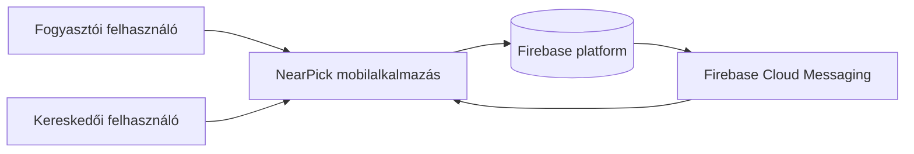
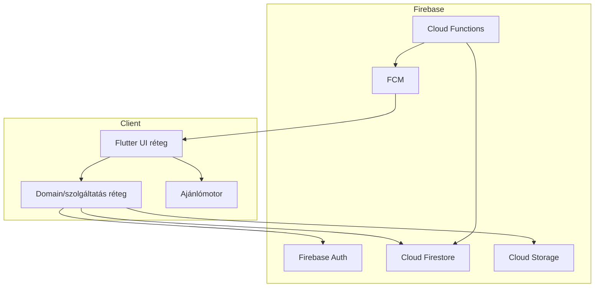

# C4 kontextus és konténerek

## C4 kontextus

### Kontextus megjegyzések

- Az elsődleges szereplők a `consumer` és a `merchant`.
- Az alkalmazás kezeli a UI-t, a kliensoldali szűrést/rangsorolást és a közvetlen Firebase SDK hívásokat.
- A backend platform Firebase (Auth, Firestore, Storage, Functions, Messaging).

## C4 konténerek

### Konténer megjegyzések

- Auth határ: a Firebase Auth session token szabályokon keresztül védi az adatelérést.
- Tárolt adatok határa: Firestore/Storage security rule-okkal.
- Külső függőségek: csak Firebase menedzselt szolgáltatások.

## Telepítési nézet (magas szintű)

- Lokális/dev: Flutter app + Firebase projektelérés vagy emulátoros útvonal.
- CI: a GitHub Actions futtatja a lint/build/test pipeline-t.
- A cél hosting/telepítési megközelítés dokumentálva van itt:
  - [`../../sprints/02/docs/adr/0001-deployment-target.md`](../../sprints/02/docs/adr/0001-deployment-target.md)
  - [`../../sprints/02/docs/adr/0003-iac-deploy-strategy.md`](../../sprints/02/docs/adr/0003-iac-deploy-strategy.md)
