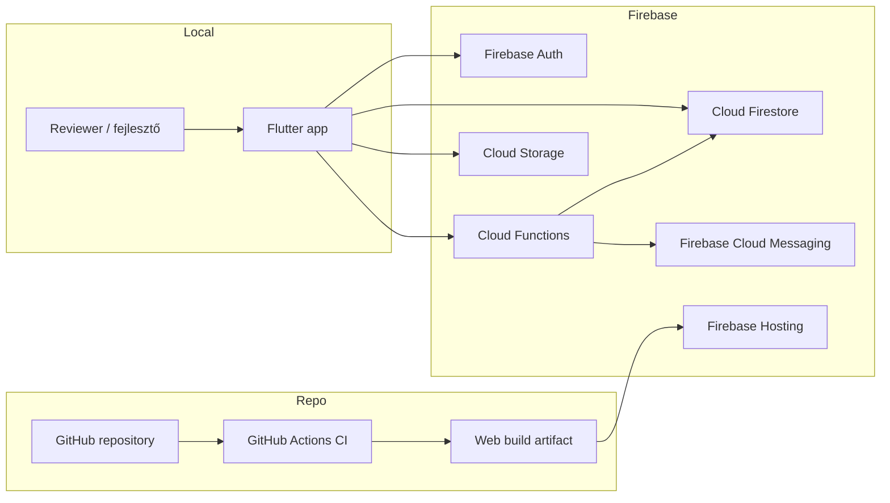

# Deployment view

Ez a dokumentum a NearPick telepítési topológiáját és a fő release egységeket írja le reviewer, demo és CI nézőpontból.

## Telepítési egységek

| Egység | Forrás | Cél |
|---|---|---|
| Flutter web build | `mobile/nearpick` | `mobile/nearpick/build/web` |
| Cloud Functions csomag | `functions/` | Firebase Functions |
| Firestore rules és indexek | `firestore.rules`, `firestore.indexes.json` | Firestore backend |
| Storage rules | `storage.rules` | Cloud Storage backend |
| Hosting konfiguráció | `firebase.json` | Firebase Hosting |

## Környezeti nézet

| Környezet | Fő cél | Fő komponensek | Megjegyzés |
|---|---|---|---|
| Lokális demo Firebase projekt | reviewer gyors kipróbálás | Flutter kliens + külön demo Firebase projekt | elsődleges bemutatási útvonal |
| Lokális emulátor mód | fejlesztői ellenőrzés | Flutter kliens + Auth/Firestore/Functions/Storage/Hosting emulátorok | opcionális, teljesebb helyi reprodukció |
| CI | quality gate és build | GitHub Actions + Flutter/Node toolchain | lint, test, build, audit |
| Release-közeli demo állapot | dokumentált evidence | zöld CI run + screenshot evidence + demo seed | nem production rollout |

## Topológia

## Emulátor topológia

Az opcionális lokális emulátoros útvonal a verziókezelt `firebase.json` alapján épül fel.

| Emulátor | Port |
|---|---:|
| UI | `4000` |
| Hosting | `5000` |
| Functions | `5001` |
| Firestore | `8080` |
| Auth | `9099` |
| Storage | `9199` |

A Flutter kliens ajánlott helyi webes portja `49914`, és emulátoros módban `--dart-define=USE_FIREBASE_EMULATORS=true` kapcsolóval futtatható.

## Release áramlás

1. A forráskód a GitHub repositoryban verziózott.
2. A CI futtatja a lint, test, build és audit lépéseket.
3. A release-evidence a zöld CI runból, a screenshot assetekből és a dokumentációból áll össze.
4. A reviewer a külön demo Firebase projekten vagy szükség esetén emulátoros úton validálja a fő flow-kat.

## Kapcsolódó artefaktumok

- [`c4_context_container.md`](c4_context_container.md)
- [`../../firebase.json`](../../firebase.json)
- [`../05_security_ops/deploy_runbook.md`](../05_security_ops/deploy_runbook.md)
- [`../06_release/demo_environment.md`](../06_release/demo_environment.md)
- [`../06_release/ci_evidence.md`](../06_release/ci_evidence.md)
